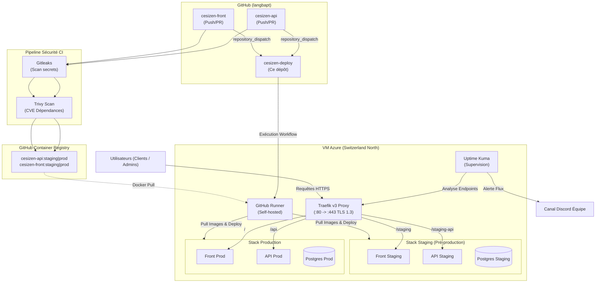

# CesiZEN — Déploiement, maintenance & sécurité

Dépôt d'infrastructure du projet **CesiZEN** (Titre CDA — Bloc 3 : *Déployer et sécuriser les applications informatiques*).
Il centralise l'orchestration Docker, le reverse proxy Traefik, les briques de supervision, les pipelines de déploiement continu (CI/CD) ainsi que la documentation des trois piliers évalués : **déploiement**, **maintenance** et **sécurisation**.

> Les composants applicatifs de l'écosystème sont versionnés dans des dépôts séparés sous l'organisation cible :
> [`cesizen-api`](https://github.com/langbapt/cesizen-api) · [`cesizen-front`](https://github.com/langbapt/cesizen-front)

---

## Sommaire
- [Vue d'ensemble](#vue-densemble)
- [Architecture de l'infrastructure](#architecture-de-linfrastructure)
- [Environnements & stratégie de routage](#environnements--stratégie-de-routage)
- [Flux CI/CD & pipeline GitOps](#flux-cicd--pipeline-gitops)
- [Nomenclature des commits & versioning](#nomenclature-des-commits--versioning)
- [Mise en route rapide sur la VM](#mise-en-route-rapide-sur-la-vm)
- [Gestion des secrets & variables](#gestion-des-secrets--variables)
- [Commandes d'exploitation courantes](#commandes-dexploitation-courantes)
- [Index de la documentation détaillée](#index-de-la-documentation-détaillée)

---

## Vue d'ensemble

| Composant | Solution retenue | Justification technique |
| :--- | :--- | :--- |
| **Hébergement** | **VM Azure** (SKU *Standard B2s*) | Localisation en région **Switzerland North** (Souveraineté, adéquation RGPD, pas de transfert hors Europe). |
| **Conteneurisation** | **Docker** & Docker Compose | Isolation des services et reproductibilité stricte entre les phases de recette et de production. |
| **Routage & Certificats** | **Traefik v3** + Let's Encrypt | Reverse proxy dynamique avec génération automatique de certificats TLS v1.3 et redirection HTTPS globale. |
| **Registre d'images** | **GHCR** (`ghcr.io/langbapt`) | Registre privé sécurisé, traçabilité par tag d'image basé sur le SHA des commits pour des rollbacks instantanés. |
| **CI/CD & Automatisation** | **GitHub Actions** + Runner auto-hébergé | Automatisation souveraine exécutée directement sur la VM cible, minimisant l'exposition des accès réseaux (pas de port SSH ouvert publiquement). |
| **Supervision** | **Uptime Kuma** + Discord Webhooks | Surveillance active de la disponibilité (> 99.5%), des temps de réponse et de l'expiration SSL avec alertes en temps réel. |

---

## Architecture de l'infrastructure



---

## Environnements & stratégie de routage

Le projet s'affranchit des contraintes multi-domaines externes en s'appuyant sur le FQDN fourni par Azure et en implémentant un **routage par préfixes de chemins (Path Prefixes)** géré nativement par Traefik :

| Environnement | Rôle | Branche Git | Préfixe de routage Front | Préfixe de routage API |
| :--- | :--- | :--- | :--- | :--- |
| **Production** | Application Grand Public | `main` | `/` | `/api` |
| **Staging** | Validation & Recette | `develop` | `/staging` | `/staging-api` |
| **Développement**| Local Sandbox | `feature/*` | `localhost:5173` | `localhost:3000` |

### Point de terminaison unique de l'infrastructure
Toutes les routes convergent vers le FQDN de la VM :  
`https://cesizen-baptiste.switzerlandnorth.cloudapp.azure.com`

---

## Flux CI/CD & pipeline GitOps

1. **Intégration Continue (CI)** : À chaque push sur les branches de référence, les dépôts applicatifs exécutent les tests unitaires (Vitest), effectuent un scan de secrets via **Gitleaks** et recherchent les vulnérabilités de dépendances avec **Trivy**.
2. **Conteneurisation** : L'image Docker est assemblée et taguée avec le tag d'environnement (`:staging` ou `:prod`) couplé au **SHA court du commit** pour assurer l'immuabilité de l'artéfact.
3. **Déclenchement (GitOps)** : Un signal `repository_dispatch` est envoyé au dépôt d'infrastructure `cesizen-deploy`.
4. **Déploiement Continu (CD)** : Le runner auto-hébergé intercepte l'action, effectue un `docker compose pull`, orchestre la mise à jour des conteneurs sans interruption de service, applique les structures de données (`prisma migrate deploy`) et vérifie le Health Check de l'API.

---

## Nomenclature des commits & versioning

Pour garantir une traçabilité totale entre le tableau de pilotage de la maintenance (GitHub Projects) et l'historique du code, le projet applique une nomenclature stricte à l'ensemble des commits et des tickets :

* **`[FEAT-XX]`** : Ajout d'une nouvelle fonctionnalité (ex: *[FEAT-02] : Implémentation du module de respiration guidée*).
* **`[FIX-XX]`** : Résolution d'une anomalie ou d'un bug applicatif (ex: *[FIX-05] : Correction du rafraîchissement des tokens d'accès*).
* **`[SEC-XX]`** : Action ou correction liée à la sécurité de l'infrastructure (ex: *[SEC-01] : Durcissement des en-têtes de sécurité HTTP avec Helmet*).
* **`[CHORE-XX]`** : Tâche de maintenance courante, mise à jour de dépendances (Dependabot) ou modification CI/CD.

---

## Mise en route rapide sur la VM

> La procédure d'installation exhaustive est disponible dans le document [`docs/04-guide-installation.md`](docs/04-guide-installation.md).

```bash
# 1. Cloner le dépôt d'infrastructure sur la VM Azure
cd /opt/cesizen
git clone [https://github.com/langbapt/cesizen-deploy.git](https://github.com/langbapt/cesizen-deploy.git) .

# 2. Initialiser l'environnement du Reverse Proxy
cp traefik/.env.example traefik/.env
# Configurer les variables ACME_EMAIL et TRAEFIK_DASHBOARD_AUTH

# 3. Lancer la brique de supervision et routage de base
docker compose -f docker-compose.monitoring.yml up -d

# 4. Configurer et démarrer le service du Runner auto-hébergé
# Suivre la procédure d'enregistrement GitHub dans /opt/actions-runner
```

---

## Gestion des secrets & variables

### Secrets d'Action requis dans `cesizen-deploy` :
* `GHCR_USER` : Identifiant GitHub autorisé (`langbapt`).
* `GHCR_TOKEN` : Personal Access Token (PAT) avec le privilège de lecture `read:packages`.
* `ENV_STAGING` : Bloc complet des variables d'environnement (`.env`) injecté au déploiement de la recette.
* `ENV_PROD` : Bloc complet des variables d'environnement (`.env`) injecté au déploiement de la production.
* `DISCORD_WEBHOOK_URL` : Jeton d'intégration pour router les alertes système vers le canal Discord de l'équipe technique.

---

## Commandes d'exploitation courantes

### Inspection des états des conteneurs (Exemple : Production)
```bash
docker compose -f compose/docker-compose.prod.yml --env-file compose/.env.prod ps
```

### Visualisation des logs de l'API de Production en temps réel
```bash
docker compose -f compose/docker-compose.prod.yml --env-file compose/.env.prod logs -f api
```

### Lancement d'une sauvegarde à chaud de la base PostgreSQL de Production
```bash
./scripts/backup-db.sh prod
```

---

## Index de la documentation détaillée

Le dossier documentaire validant les compétences du Bloc 3 est découpé selon la structure suivante :

| Référence du document | Objectif et critères couverts |
| :--- | :--- |
| 📁 **[`docs/01-plan-deploiement.md`](docs/01-plan-deploiement.md)** | Architecture complète, stratégie réseau par chemins, automatisation et processus de rollback. |
| 📁 **[`docs/02-plan-maintenance.md`](docs/02-plan-maintenance.md)** | Gestion du ticketing, grille de criticité SLA, processus d'évolution et veille technologique. |
| 📁 **[`docs/03-plan-securisation.md`](docs/03-plan-securisation.md)** | Matrice des risques (OWASP), contre-mesures (Helmet, Rate-limit), gestion de crise et conformité RGPD. |
| 📁 **[`docs/04-guide-installation.md`](docs/04-guide-installation.md)** | Guide opérationnel pas-à-pas pour reconstruire l'infrastructure complète de zéro sur la VM Azure. |
| 📁 **[`docs/05-rgpd.md`](docs/05-rgpd.md)** | Registre des traitements (Art. 30), minimisation des données (module de respiration) et droit à l'oubli. |