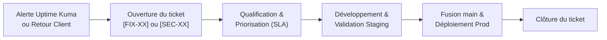

# Plan de maintenance — CesiZEN

## 1. Outil de gestion et de ticketing : GitHub Issues & Projects

La maintenance corrective, préventive et évolutive de l'écosystème CesiZEN est centralisée sur GitHub. L'utilisation de **GitHub Issues** combinée à un tableau **GitHub Projects (Kanban)** permet de lier la gestion de projet directement aux lignes de code et à l'historique Git.

### 1.1 Alignement avec la convention de nommage
Pour assurer une traçabilité totale entre le besoin métier et le code, chaque ticket ouvert doit adopter une nomenclature stricte dans son titre :
* **`[FIX-XX]`** : Correction d'une anomalie ou d'un bug (ex: `[FIX-03] : Correction de la dérive de routage Traefik`).
* **`[SEC-XX]`** : Tâche liée à la sécurité ou correction de faille (ex: `[SEC-02] : Mise à jour des règles de pare-feu Azure`).
* **`[FEAT-XX]`** : Demande d'évolution ou nouvelle fonctionnalité (ex: `[FEAT-04] : Ajout d'un nouvel exercice de respiration`).
* **`[CHORE-XX]`** : Tâches de maintenance technique, CI/CD ou mise à jour de dépendances.

### 1.2 Organisation du Board Kanban
Le pilotage opérationnel s'effectue via le tableau de bord global *« CesiZEN — Suivi Maintenance »*. Les tickets transitent dynamiquement à travers les colonnes suivantes :
1. **Backlog** : Idées, rapports d'anomalies bruts et demandes d'évolutions non priorisées.
2. **À traiter** : Tickets qualifiés, assignés et planifiés pour le cycle de maintenance en cours.
3. **En cours** : Tâches en cours de développement sur une branche isolée (`feature/*` ou `fix/*`).
4. **En validation** : Code déployé automatiquement sur l'environnement de **Staging** pour validation fonctionnelle et validation des Health Checks.
5. **Terminé** : Code fusionné sur la branche `main` et déployé avec succès en **Production**.

---

## 2. Méthodologie de gestion des incidents (SLA)

L'ouverture d'un ticket de type `[FIX]` ou `[SEC]` peut provenir d'une déclaration manuelle de l'utilisateur ou d'une **détection automatisée via Uptime Kuma** (alerte instantanée sur le canal Discord de l'équipe technique).

### 2.1 Grille de criticité et engagements de service (SLA)

| Niveau de sévérité | Définition technique | Prise en compte / Diagnostic | Délai maximal de résolution |
| :--- | :--- | :---: | :---: |
| **Bloquant — Critique** | Application totalement indisponible (ex: API de Prod down, crash de la base PostgreSQL). | **1 h** ouvrée | **3 h** ouvrées |
| **Majeur** | Dysfonctionnement d'un module clé sans solution de contournement (ex: Échec des inscriptions, module Respiration inaccessible). | **4 h** ouvrées | **12 h** ouvrées |
| **Mineur** | Bug graphique, coquille ou dégradation légère des performances n'altérant pas le fonctionnement global. | **1 jour** ouvré | Prochain lot de maintenance |

### 2.2 Répartition des responsabilités

* **Le Client (Ministère)** : Déclare l'anomalie fonctionnelle ou valide la recette des corrections proposées sur l'environnement de Staging.
* **L'Équipe DevOps (Prestataire)** : Analyse les logs système (Traefik/API), qualifie le niveau de sévérité, applique le correctif en local, valide la CI et orchestre le déployement sécurisé.

---

## 3. Processus de gestion des évolutions (`[FEAT]`)

Toute demande d'évolution physique ou d'infrastructure suit un cycle de déploiement strict et sécurisé afin de garantir la non-régression de la Production :

1. **Étude d'impact** : Analyse de la demande, évaluation de la sécurité (impact RGPD) et rédaction des critères d'acceptation dans un ticket `[FEAT-XX]`.
2. **Développement isolé** : Création d'une branche Git dédiée à partir de `develop` (ex: `feature/respiration-module`).
3. **Validation en Staging** : Push sur la branche `develop`, déclenchement de la pipeline CI/CD, passage des tests unitaires, build de l'image Docker, et déploiement automatique sur l'environnement de Staging.
4. **Mise en Production** : Après validation fonctionnelle sur l'environnement de Staging, une *Pull Request* est validée vers la branche `main` pour mettre à jour l'application grand public de manière transparente.

---

## 4. Garanties d'évolutivité et veille technologique

Pour éviter la dette technique et anticiper les failles de sécurité avant qu'elles ne se manifestent, la maintenance s'appuie sur une automatisation de la veille :

### 4.1 Outils de surveillance automatisés
* **Scan Trivy (CI Applicative)** : Inspecte les images Docker et les dépendances npm à la recherche de vulnérabilités connues (CVE).
* **Gitleaks (CI Infrastructure)** : Intégré directement dans notre pipeline de déploiement `deploy.yml`, il valide l'absence totale de secrets ou d'identifiants en clair dans le code source avant toute action sur la VM Azure.

### 4.2 Sources de veille stratégique
L'équipe technique consacre un temps dédié à la surveillance des canaux d'informations majeurs :
* **Bulletins de sécurité** : Alertes du **CERT-FR** (ANSSI) et base **GitHub Advisory Database**.
* **Écosystème technique** : Suivi des notes de version majeures de **Node.js**, **Prisma ORM**, **Traefik Proxy** et des distributions **Ubuntu LTS**.

---

## 5. Indicateurs de performance et pilotage (Dashboards)

Le maintien en conditions opérationnelles de CesiZEN s'appuie sur deux tableaux de bord majeurs, démontrables lors des revues de projet :
1. **Le Dashboard de Gestion (GitHub Projects)** : Offre une vue macroscopique sur la charge de travail, la vélocité de résolution des bugs (`[FIX]`) et le volume de fonctionnalités en attente de déploiement.
2. **Le Dashboard Opérationnel (Uptime Kuma)** : Fournit un historique précis et en temps réel du taux de disponibilité (Objectif : **> 99.5%**), des temps de réponse moyens de l'API (en millisecondes) ainsi que le suivi de la date d'expiration des certificats SSL Let's Encrypt pour anticiper leur renouvellement automatique.