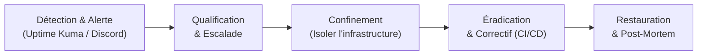

# Plan de sécurisation — CesiZEN

## 1. Analyse des vulnérabilités & matrice de risques

La criticité est calculée selon la formule : **Criticité = Probabilité × Impact** (Échelle de 1 à 5 -> Score de 1 à 25 : Faible ≤ 5, Moyen 6 à 12, Élevé 13 à 25).

| # | Vulnérabilité / Risque | Réf. OWASP | Prob. | Impact | Criticité | Statut & Couverture |
|---|---|---|---|---|---|---|
| **R1** | Injections (SQL, NoSQL) | A03:2021 | 1 | 5 | **5 — Faible** | Couvert nativement par l'ORM Prisma (requêtes paramétrées) et la validation stricte de types Zod. |
| **R2** | Vol d'identifiants / Brute-force | A07:2021 | 3 | 4 | **12 — Moyen** | Couvert par le hachage lourd **Argon2id** et le mécanisme de verrouillage temporaire de l'API. |
| **<b>R3</b>** | Fuite ou exposition de secrets (clés, JWT) | A02:2021 | 2 | 5 | **10 — Moyen** | Couvert par l'injection via variables d'environnement (`.env`) et le scan bloquant **Gitleaks** en CI. |
| **R4** | En-têtes HTTP absents / CORS permissif | A05:2021 | 3 | 3 | **9 — Moyen** | Couvert par l'intégration du middleware **Helmet** et une whitelist CORS restreinte aux domaines applicatifs. |
| **R5** | Déni de service (DoS) / Abus d'API | A04:2021 | 3 | 3 | **9 — Moyen** | Couvert par **express-rate-limit** configuré spécifiquement sur les routes sensibles (authentification). |
| **R6** | Interception de flux réseau (Man-in-the-Middle) | A02:2021 | 2 | 5 | **10 — Moyen** | Couvert par la terminaison TLS v1.3 gérée par **Traefik v3** avec génération automatique de certificats Let's Encrypt. |
| **R7** | Compromission du runner GitHub Actions | A08:2021 | 2 | 4 | **8 — Moyen** | Couvert par l'exécution du runner en mode non-root, isolé au sein de l'hôte et limité au scope strict du dépôt. |
| **R8** | Perte de persistance (panne matérielle / crash) | — | 2 | 5 | **10 — Moyen** | Couvert par l'automatisation des scripts `pg_dump` avec rétention glissante de 14 jours. |
| **R9** | Utilisation de dépendances vulnérables (CVE) | A06:2021 | 3 | 4 | **12 — Moyen** | Couvert par les alertes **Dependabot** hebdomadaires et l'analyse d'images via **Trivy** dans la CI. |
| **R10**| Contournement des droits d'accès (RBAC) | A01:2021 | 2 | 5 | **10 — Moyen** | Couvert par des middlewares de contrôle de rôles couplés à une vérification systématique de la validité du compte. |
| **R11**| Attaque par force brute sur l'accès SSH | A07:2021 | 2 | 5 | **10 — Moyen** | Couvert par la désactivation de l'authentification par mot de passe (clés SSH uniquement) et restriction NSG Azure. |
| **R12**| Défaut de mise à jour du système hôte | A06:2021 | 2 | 4 | **8 — Moyen** | Géré par une routine de maintenance préventive et le suivi des bulletins du CERT-FR. |
| **R13**| Exposition accidentelle de services internes | A05:2021 | 1 | 5 | **5 — Faible** | Couvert par le cloisonnement des réseaux virtuels Docker (PostgreSQL n'expose aucun port sur l'IP publique). |

---

## 2. Actions préventives & correctives

### 2.1 Implémentation technique des contre-mesures
* **Sécurisation de la couche applicative (R1, R2, R4, R5, R10)** :
  L'API Node.js utilise le package `helmet` pour injecter les en-têtes de sécurité indispensables (`X-Frame-Options`, `Content-Security-Policy`, etc.) et masquer la signature technologique (`X-Powered-By`). Le module `express-rate-limit` applique une restriction globale de 300 requêtes par tranche de 15 minutes, abaissée à 10 requêtes pour les endpoints d'authentification (`/api/auth/login`).
* **Protection contre l'interception de flux (R6)** :
  Traefik v3 force la redirection systématique de l'ensemble du trafic HTTP (port 80) vers le protocole HTTPS sécurisé (port 443). La configuration TLS impose le protocole minimum **TLS 1.3** et active la directive **HSTS (HTTP Strict Transport Security)** pour contraindre les navigateurs à n'échanger que via des canaux chiffrés.
* **Sécurisation des infrastructures et réseaux (R11, R13)** :
  Le groupe de sécurité réseau (NSG) d'Azure fait office de premier pare-feu périphérique, complété sur la VM par le pare-feu local `ufw`. Seuls les ports `22`, `80` et `443` sont ouverts sur l'interface publique. Les conteneurs de base de données PostgreSQL (Prod et Staging) communiquent exclusivement au sein de réseaux Docker internes isolés et étanches.

> **Validation empirique** : La conformité de la configuration TLS et l'absence de l'en-tête `X-Powered-By` peuvent être auditées publiquement à l'adresse de l'infrastructure via la commande :  
> `curl -I https://cesizen-baptiste.switzerlandnorth.cloudapp.azure.com/api/health`

---

## 3. Gestion de crise et d'incidents de sécurité

L'équipe technique s'appuie sur une procédure standardisée pour réagir face à toute anomalie détectée ou notifiée par la supervision active d'**Uptime Kuma** :

### 3.1 Outils et actions spécifiques par phase
* **Confinement** : En cas de compromission avérée d'un compte ou d'un jeton, l'API permet la révocation instantanée des *refresh tokens* en base de données et le passage immédiat de l'utilisateur au statut `actif = false` (bloquant immédiatement toute requête ultérieure). Si l'attaque cible l'infrastructure, le trafic peut être restreint ou coupé à la volée via Traefik ou en modifiant les règles du NSG Azure.
* **Éradication** : Développement du correctif en local, validation par la suite de tests unitaires Vitest, puis déploiement automatisé d'une nouvelle version saine de l'image Docker identifiée par son tag SHA unique.
* **Restauration** : Si l'intégrité des données est corrompue, application de la procédure de reprise d'activité à l'aide du script `scripts/restore-db.sh` pour réinjecter la dernière sauvegarde PostgreSQL valide.

### 3.2 Escalade, responsabilités et conformité réglementaire
* **Niveau 1 (Astreinte technique)** : Diagnostic initial, isolation de l'incident et qualification de la sévérité.
* **Niveau 2 (Responsable d'infrastructure / DevOps)** : Prise de décision sur le confinement lourd, développement du correctif et déploiement d'urgence.
* **Niveau 3 (Direction & DPO)** : Enclenché en cas de violation avérée de données personnelles. Conformément aux articles 33 et 34 du RGPD, le DPO procède à la notification officielle auprès de la **CNIL dans un délai maximal de 72 heures**, et informe directement par email les utilisateurs concernés si l'incident présente un risque élevé pour la confidentialité de leurs accès.

---

## 4. Données personnelles & RGPD (Privacy by Design)

Le projet CesiZEN intègre nativement les principes fondamentaux du RGPD (Règlement Général sur la Protection des Données) :

* **Minimisation drastique des données (Art. 5)** : Suite au choix d'intégrer un **module de respiration** à la place d'un suivi d'humeur psychologique, l'application ne collecte, ne traite ni ne stocke **aucune donnée sensible ou de santé (Art. 9)**. Les informations collectées se limitent au strict nécessaire fonctionnel : un pseudonyme, une adresse email et l'historique d'utilisation des exercices (durée, horodatage).
* **Souveraineté de l'hébergement** : L'ensemble de la stack technique est localisé au sein de la région **Switzerland North de Microsoft Azure**. La Suisse bénéficiant d'une décision d'adéquation de la Commission européenne, la confidentialité des données est assurée sans aucun transfert transfrontalier hors zone de protection équivalente.
* **Chiffrement systématique** : Les données en transit sont protégées par le chiffrement HTTPS (TLS 1.3). Les données au repos (mots de passe) subissent un hachage irréversible via l'algorithme de pointe **Argon2id**.
* **Autonomie et exercice des droits** : L'API intègre nativement des endpoints dédiés permettant aux utilisateurs d'exercer leurs droits en totale autonomie : l'export complet de leurs données au format JSON (`GET /api/auth/me/export`) pour le droit à la portabilité (Art. 20), et la suppression définitive du compte entraînant un effacement en cascade en base de données (`DELETE /api/auth/me`) pour le droit à l'oubli (Art. 17).

---

## 5. Bonnes pratiques de développement (Secure Development)

La sécurité du projet est maintenue au quotidien par l'application de standards rigoureux tout au long du cycle de vie du logiciel :
* **Qualité et typage** : Utilisation exclusive de **TypeScript** en mode strict et validation systématique des payloads d'entrée (corps des requêtes, paramètres d'URL) à l'aide de schémas de validation **Zod** pour bloquer toute tentative d'injection ou de corruption de mémoire.
* **Contrôle automatisé (CI/CD)** : Une suite de **113 tests automatisés** (unitaires et intégration) s'exécute à chaque Pull Request. L'échec d'un seul test bloque immédiatement la pipeline et empêche la construction de l'image Docker.
* **Vérification automatique des secrets** : Le workflow d'infrastructure intègre l'outil **Gitleaks** afin d'analyser l'intégralité du code source et d'interrompre immédiatement le déploiement si un secret, un mot de passe ou une clé privée venait à être détectée en clair dans les commits.
* **Gouvernance Git** : Utilisation stricte d'un workflow de branches structuré (`main`, `develop`, `feature/*`). Tout ajout de code doit impérativement faire l'objet d'une Pull Request (PR) et d'une validation technique par les pairs avant d'être fusionné.